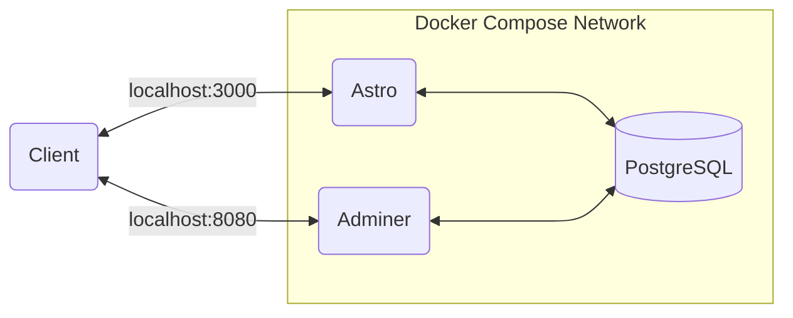

# Laitilan Jyske - Yleisurheilu

Website for track & field sport club Laitilan Jyske.

## Table of contents

- [Folder structure](#folder-structure)
- [Environment variables](#environment-variables)
  - [Astro](#astro)
- [Development](#development)
  - [Docker Compose architecture](#docker-compose-architecture)
  - [Running the application](#running-the-application)
  - [DB Migrations](#db-migrations)
  - [Installing new npm packages](#installing-new-npm-packages)
  - [Adminer](#adminer)
- [Other remarks](#other-remarks)
  - [Development with Visual Studio Code](#development-with-visual-studio-code)

## Folder structure

```
.
├── .vscode                  Project-spesific Visual Studio Code settings
├── README.md                Documentation
├── astro                    Source code for Astro application
├── config                   Configuration files for development
└── docker-compose.yml       Docker Compose for development environment
```

## Environment variables

Below are listed all of the environment variables that the application needs. If you add a new environment variable, add it's name and the description on the table below.

### Astro

| Environment Variable | Description                   |
| -------------------- | ----------------------------- |
| DATABASE_URL         | PostgreSQL connect URL string |

## Development

Docker is needed to develop the application. Install instructions for Docker can be found [here](https://docs.docker.com/get-docker/). Environment variables for the development environment are defined in the config folder.

### Docker Compose architecture



### Running the application

```sh
# Start the application
docker compose up

# Shutdown the application and drop the volumes
docker compose down --volumes

# Rebuild the docker images (volumes must be dropped before rebuilding)
docker compose build
```

### DB Migrations

// Todo

### Installing new npm packages

```sh
# Install a new npm package to a running container
docker compose exec astro npm install [--options] <package_name>

# Or install npm package locally and rebuild the docker images
cd astro && npm install [--options] <package_name> && cd ../
docker compose down --volumes
docker compose up --build
```

### Adminer

Adminer is used to browse PostgreSQL database in the development environment. Navigate to [http://localhost:8080](http://localhost:8080) to open the Adminer service.

Connect to the PostgreSQL with development environment credentials:

- system: PostgreSQL
- server: postgres
- username: postgres
- password: postgres

## Other remarks

### Development with Visual Studio Code

Visual Studio Code will output typescript errors if you have not installed all the required npm packages locally. For that reason `npm install` has to be ran after new npm package(s) has been installed inside the corresponding docker container.

After cloning this repository `npm install` must be run on astro folder before using Docker Compose -commands. This ensures that the astro/node_modules folder gets right permissions for you to update it's contents. If `docker compose up` is ran before installing npm dependencies, you will get permission error when you try to install the dependencies locally on your machine afterwards.
