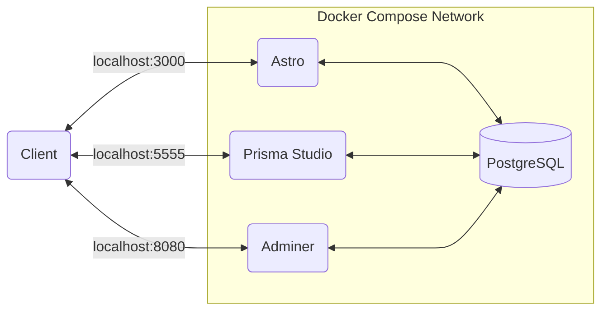

# Laitilan Jyske - Yleisurheilu

Website for track & field sport club Laitilan Jyske.

## Table of contents

- [Folder structure](#folder-structure)
- [Environment variables](#environment-variables)
  - [Astro](#astro)
- [Development](#development)
  - [Docker Compose architecture](#docker-compose-architecture)
  - [Running the application](#running-the-application)
  - [Installing new npm packages](#installing-new-npm-packages)
  - [DB Schema and Migrations](#db-schema-and-migrations)
  - [Prisma Studio](#prisma-studio)
  - [Adminer](#adminer)
- [Other remarks](#other-remarks)
  - [Development with Visual Studio Code](#development-with-visual-studio-code)

## Folder structure

```
.
├── .vscode                  - VS Code workspace config
│   ├── extensions.json          - Recommended extensions for VS Code
│   └── settings.json            - Project spesific settings for VS Code
├── README.md                - Documentation
├── astro                    - Astro application
│   ├── .eslintrc.js             - ESLint config
│   ├── .prettierrc              - Prettier config
│   ├── Dockerfile               - Docker image instructions
│   ├── astro.config.mjs         - Astro config
│   ├── prisma                   - DB schema and migration files
│   ├── public                   - Public files to serve unprocessed
│   ├── src                      - Source code for Astro application
│   │   ├── components               - Astro or React components for the pages
│   │   ├── layouts                  - Layouts for the pages
│   │   ├── lib                      - Common library files
│   │   └── pages                    - Pages for the website
│   ├── tailwind.config.cjs      - Tailwind config
│   └── tsconfig.json            - TypeScript config
├── config                   - Configuration files for development
│   └── astro                    - Astro related config
│       ├── .env                     - Environment variables
│       └── .env.example             - Example for .env file
└── docker-compose.yml       - Docker Compose for development environment
```

## Environment variables

Below are listed all of the environment variables that the application needs. If you add a new environment variable, add it's name and the description on the table below.

### Astro

| Environment Variable | Description                            |
| -------------------- | -------------------------------------- |
| PUBLIC_BASE_URL      | Domain base URL                        |
| PUBLIC_SUPABASE_URL  | Supabase client URL                    |
| PUBLIC_SUPABASE_KEY  | Supabase client key for public access  |
| PRIVATE_SUPABASE_KEY | Supabase client key for private access |
| DATABASE_URL         | PostgreSQL connect URL string          |
| ASTROAUTH_URL        | Astro Auth base URL                    |
| ASTROAUTH_SECRET     | Astro Auth secret                      |
| GOOGLE_CLIENT_ID     | Google OAuth Web Client ID             |
| GOOGLE_CLIENT_SECRET | Google OAuth Web Client secret         |

## Development

Docker is needed to develop the application. Install instructions for Docker can be found [here](https://docs.docker.com/get-docker/). Environment variables for the development environment are defined in the config folder. Copy the .env.example file to .env file and fill in the needed values for variables.

### Docker Compose architecture



### Running the application

```sh
# Start the application
docker compose up

# Shutdown the application and drop the volumes
docker compose down --volumes

# Rebuild the docker images (volumes must be dropped before rebuilding)
docker compose build
```

### Installing new npm packages

```sh
# Install a new npm package to a running container
docker compose exec astro npm install [--options] <package_name>

# Or install npm package locally and rebuild the docker images
cd astro && npm install [--options] <package_name> && cd ../
docker compose down --volumes
docker compose up --build
```

### DB Schema and Migrations

[Prisma](https://www.prisma.io/) is used as an ORM between the application and the DB. As so, all DB related files like the schema and the migration files are found from the _astro/prisma_ folder.

[Prisma Migrate](https://www.prisma.io/docs/concepts/components/prisma-migrate) is used to create and run DB migrations. Existing migrations are ran automatically when `docker compose up` is executed. If you change the DB schema, a new migration has to be created. Add a descriptive name for a new migration (e.g. create_table_post)

```sh
# Create a new migration
docker compose exec astro npm run prisma migrate dev -- --name <migration_name>
```

### Prisma Studio

Prisma Studio is a visual editor for the data in the database. Prsima Studio can be used to easily create and browse records for the models that have been defined in the schema. Navigate to [http://localhost:5555](http://localhost:5555) to open the Prisma Studio.

### Adminer

Adminer is another way to browse PostgreSQL database in the development environment. Navigate to [http://localhost:8080](http://localhost:8080) to open the Adminer service.

Connect to the PostgreSQL with development environment credentials:

- system: PostgreSQL
- server: postgres
- username: postgres
- password: postgres
- database: development

## Other remarks

### Development with Visual Studio Code

Visual Studio Code will output typescript errors if you have not installed all the required npm packages locally. For that reason `npm install` has to be ran after new npm package(s) has been installed inside the corresponding docker container.

After cloning this repository `npm install` must be run on astro folder before using Docker Compose -commands. This ensures that the astro/node_modules folder gets right permissions for you to update it's contents. If `docker compose up` is ran before installing npm dependencies, you will get permission error when you try to install the dependencies locally on your machine afterwards.

Also when a new migration is generated on the docker container, the prisma client has to be generated locally by running `npm run prisma generate` for new typings to be available in VS Code.
